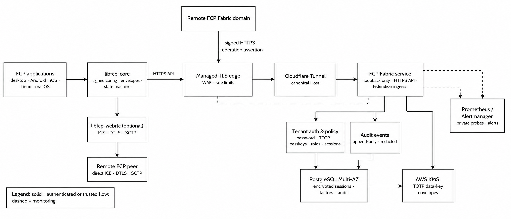

# Federated CFR Connect Protocol (FCP)

A signed **federation-connection protocol** for delivering exact
[Causal Frontier Ratchet](https://crates.io/crates/cfr_protocol) control bytes
between WebRTC-capable federation members, implemented in Rust. FCP separates
three concerns deliberately: a signed federation configuration, authenticated
peer signaling, and a reliable ordered control channel for CFR payloads.

> **v1.0.0-rc.1:** this release candidate is ready for integration and
> independent review, but is not a final API or wire-format stability promise.
> The portable FCP crates do not provide hosted signaling, TURN infrastructure,
> published foreign-language packages, a real browser WebRTC acceptance result or an external security audit. Local source façades for native FFI and browser WASM are implemented and tested; see [`docs/bindings.md`](docs/bindings.md). The optional `fcp-fabric-*`
> platform provides the loopback-only HTTP origin behind a managed TLS edge, tenant authentication,
> PostgreSQL persistence, AWS KMS TOTP envelope integration and federation policy
> layers; read [`docs/fabric/README.md`](docs/fabric/README.md) and
> [`docs/security.md`](docs/security.md) before deployment and
> [`docs/prereleases/v1.0.0-rc.1.md`](docs/prereleases/v1.0.0-rc.1.md) before
> publishing a product on this RC boundary.

```toml
[dependencies]
libfcp = "1.0.0-rc.1"
libfcp-webrtc = "1.0.0-rc.1" # optional concrete Rust/Tokio adapter
```

## What it is

A federation operator may publish a signed configuration that binds explicit
CFR participant identities to complete FCP endpoint identities. Each member pins
the authority identity out of band, validates a strictly newer snapshot, then
uses FCP to bind offer, answer and candidate signaling to a federation, attempt
and exact endpoint pair. No carrier becomes trusted merely because it carried a
configuration or signaling message.



| property | how |
|---|---|
| explicit federation policy | Canonical signed `FCFG` snapshots carry a federation ID, complete authority identity, monotonic epoch and bounded unique CFR-to-FCP bindings. |
| untrusted delivery | An application-owned carrier may relay, reorder, drop or duplicate configuration and signaling bytes; verification remains local. |
| authenticated signaling | Canonical `FCP` envelopes bind federation, attempt, complete sender/recipient identities and WebRTC description fingerprints under both Ed25519 and ML-DSA-65. |
| bounded hostile input | Fixed protocol limits, verify-before-allocation decoding, bounded replay FIFO and bounded local ICE staging. |
| exact CFR delivery | `Message.payload` routes only through explicit bindings and established connections, without reinterpretation or mutation. |
| direct control transport | The fixed FCP channel is binary, ordered and reliable over ICE → DTLS → SCTP. |

## Layout

| crate | contents |
|---|---|
| `libfcp` | Primary member SDK: authority-pinned configuration acceptance, peer directory, exact CFR routing and the engine-neutral `transport` contract. |
| `libfcp-core` | Portable `no_std + alloc` FCP wire grammar, mandatory dual-signature authentication, state machine, bounded replay and signed configuration records. |
| `libfcp-server` | In-process configuration authority for an operator-controlled admission policy; it is not a daemon, relay or CFR participant. |
| `libfcp-webrtc` | Optional Rust/Tokio WebRTC.rs adapter with signed application-owned signaling and a real data channel. |
| `libfcp-ffi` | Audited native C ABI with opaque signer/client/connection handles, a public C header and local C/C++/Python/Java/Kotlin/C#/Go façades. These artifacts are not published. |
| `libfcp-wasm` | Dedicated `wasm-bindgen` browser/Node façade over the portable core. JavaScript owns WebRTC and signaling; the npm artifact is not published. |
| `fcp-fabric-domain` | Portable tenant domain, account, role, policy and audit types. |
| `fcp-fabric-auth` | Argon2id, encrypted TOTP and opaque token primitives; it retains no database or HTTP policy. |
| `fcp-fabric-store` | PostgreSQL migrations and tenant-scoped Fabric transactions. |
| `fcp-fabric-service` | Loopback-only Axum HTTP origin API behind a managed TLS edge; authentication/MFA, opaque sessions, signed federation ingress and AWS KMS-backed TOTP envelope integration. |
| `FCP Fabric CLI` | Environment-only migration and one-time bootstrap CLI; it intentionally has no password or secret-key flags. |

Each package has a narrow role. A normal member uses `libfcp` plus a selected
adapter; an operator uses `libfcp-server` only where it owns federation policy.
The adapter contract stays in `libfcp::transport`, so an application never has
to assemble a separate generic transport package.

## Primitives

FCP composes established signature and hash primitives; it does not introduce a new cryptographic primitive.

| role | primitive | crate |
|---|---|---|
| mandatory classical endpoint and authority signatures | Ed25519 | [`ed25519-dalek`](https://crates.io/crates/ed25519-dalek) |
| mandatory post-quantum endpoint and authority signatures | ML-DSA-65 (FIPS 204) | [`ml-dsa`](https://crates.io/crates/ml-dsa) — not independently audited by this project |
| identifiers and WebRTC bindings | BLAKE3 | [`blake3`](https://crates.io/crates/blake3) |
| CFR group agreement and payload semantics | CFR | [`cfr_protocol`](https://crates.io/crates/cfr_protocol) |
| concrete peer transport | ICE, DTLS and SCTP data channels | [`webrtc`](https://crates.io/crates/webrtc) |

## Features

| package / feature | effect |
|---|---|
| `libfcp-core` without `std` | portable FCP protocol core with `alloc` only |
| `libfcp` `std` *(default)* | standard library support for the member SDK and CFR dependency |
| FCP authentication boundary | Ed25519 and ML-DSA-65 are both mandatory for configuration and signaling; no legacy fallback exists. WebRTC DTLS remains non-post-quantum. |
| `libfcp-webrtc` | optional concrete Rust/Tokio adapter; Rust 1.98+ because of its WebRTC.rs dependency graph |

## Testing

```bash
# Portable protocol core, SDK and embedded configuration authority: Rust 1.85.
cargo +1.85.0 fmt --all -- --check
cargo +1.85.0 test -p libfcp-core -p libfcp -p libfcp-server --locked
cargo +1.85.0 clippy -p libfcp-core -p libfcp -p libfcp-server --all-targets --locked -- -D warnings
cargo +1.85.0 check -p libfcp-core --no-default-features --locked --target aarch64-linux-android
cargo +1.85.0 check -p libfcp-core --no-default-features --locked --target aarch64-apple-ios
cargo +1.85.0 check -p libfcp-core --no-default-features --locked --target wasm32-unknown-unknown

# Stable runtime components: WebRTC adapter and FCP Fabric platform.
cargo +stable test -p libfcp-webrtc --tests --locked -- --nocapture
cargo +stable clippy -p libfcp-webrtc -p fcp-fabric-domain -p fcp-fabric-auth \
  -p fcp-fabric-store -p fcp-fabric-service -p fcp-fabric --all-targets --locked -- -D warnings

# Local native/JVM/WASM/.NET/Go foreign-binding matrix; builds only temporary artifacts and never uploads.
./scripts/test_foreign_bindings.sh

# One-time FCP Fabric bootstrap (database URL never appears in CLI arguments).
export FCP_DATABASE_URL='postgres://…'
cargo +stable run -p fcp-fabric -- migrate
cargo +stable run -p fcp-fabric -- tenant bootstrap --domain parley.io --owner benjamin
```

The suite covers canonical dual-signature wire behavior, independent signature
tampering, hostile input, full-identity state transitions, CFR byte preservation,
authority pinning, adapter ordering, signed graceful close and a real localhost
ICE → DTLS → SCTP → DataChannel connection.

## Documentation

| need | canonical document |
|---|---|
| FCP wire grammar, mandatory authentication, state machine and WebRTC contract | [`docs/protocol.md`](docs/protocol.md) |
| threat model, guarantees, non-goals and deployment boundary | [`docs/security.md`](docs/security.md) |
| member and adapter integration | [`docs/integration.md`](docs/integration.md) |
| Implemented local C/C++/Python/Java/Kotlin/JS/C#/Go façades, ABI contract and publication gates | [`docs/bindings.md`](docs/bindings.md) |
| FCP configuration and Fabric operations | [`docs/operations.md`](docs/operations.md) |
| multi-tenant FCP Fabric platform, bootstrap CLI and implementation status | [`docs/fabric/README.md`](docs/fabric/README.md) |
| contribution policy, MSRV and release gates | [`CONTRIBUTING.md`](CONTRIBUTING.md) |
| RC compatibility and crates.io publishing order | [`docs/prereleases/v1.0.0-rc.1.md`](docs/prereleases/v1.0.0-rc.1.md) |
| private vulnerability reporting | [`SECURITY.md`](SECURITY.md) |

## Licence

GPL-3.0-only.
